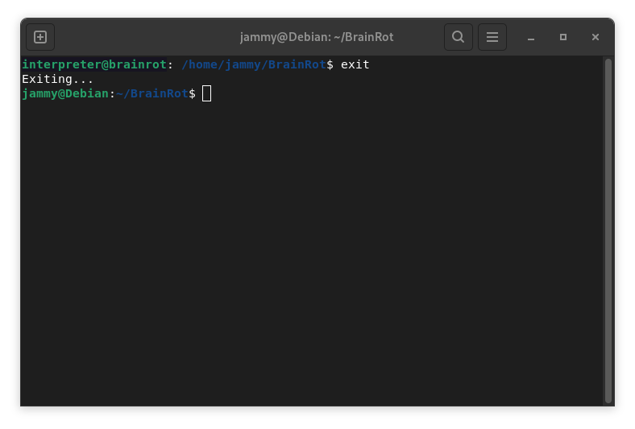

# BrainRot
Brainrot language will change the way you write code.


# Before you go
## Requirement
Python 3 must be installed. Download Python from [python.org](https://python.org).

## Download BrainRot interpreter
If you've installed Git, we highly recommend clone the repository.
```
git clone https://github.com/jammyjunior/BrainRot.git
```
Or you can also go to `code`, click `Download ZIP` to download the project. Then unzip the file.


## Run BrainRot interpreter
On Windows, open Command Prompt.    <br/>
On Linux or macOS, open Terminal.

Then type:
```
python3 /path/to/your/file/BrainRot/BrainRot.py
```
If you see this one, congrats, now you can start using BrainRot interpreter.


# Acknowledgement
Comming soon

# User Guide

## Run BrainRot interpreter directly
To Run BrainRot interpreter directly, type `br` and then press enter.


Now you can start writing BrainRot code directly.


## Run file using BrainRot interpreter
To do this, first you need to have a file written in BrainRot or Binary language.


Run the BrainRot interpreter, and then type:
```
br /path/to/your/file
```


## BrainRot2Binary and Binary2BrainRot
BrainRot2Binary(br2b) and Binary2BrainRot(b2br) are the scripts used to convert languages in files. For example, if I want to convert my test.txt file to Binary code, I would type:
```
br2b test.txt
```


Remember `test.txt` is the path to your file.<br/>
Here is the output:


Same as with `b2br`:


## Show file contents with `cat`
The `cat` command  is a very cool tool in Linux. In BrainRot interpreter, `cat` use to display file contents.


## Clear the terminal
To clear the terminal, type `clear`.

## Change Directory with `cd`
In most operating system, `cd` command uses to navigate around the computer. In BrainRot interpreter, `cd` works the same way too! <br/>
Here is an example:


## List directory contents with `ls`
Another powerful command in Linux is `ls`. In BrainRot interpreter, `ls` command uses to display all sub-folders and files inside the folder.


## Show help
To display all available commands, type `help`.


## Exit the interpreter
To exit the BrainRot interpreter, just simply type 'exit'.



# Contributing
Pull requests are welcome!

This project isn't perfect, and I'm always looking for ways to improve it. If you're interested in helping, feel free to submit a pull request.

I want to make BrainRot more complicated. If you have any ideas, share it with me.

Thanks for your help! ❤️